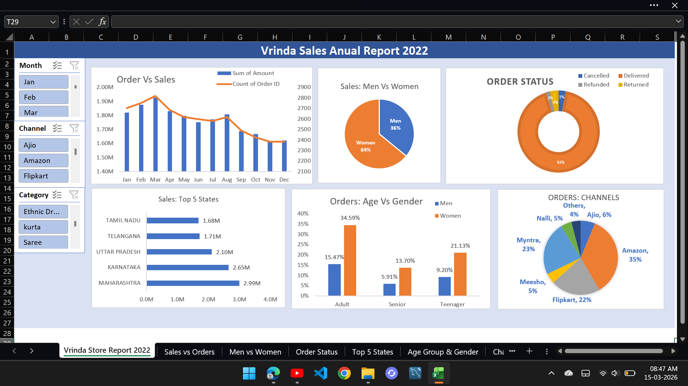
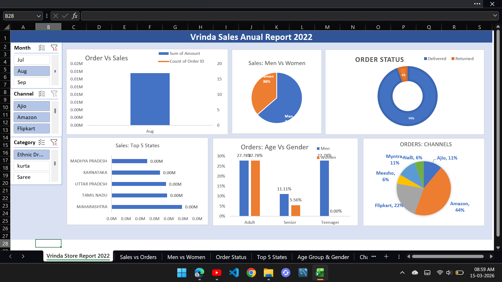

# Vrinda Store Annual Report (Excel)

This project is an interactive sales dashboard built using Microsoft Excel.

## Features
- Monthly sales analysis
- Orders vs sales comparison
- Sales distribution by gender
- Order status analysis
- Top 5 performing states
- Age group vs gender orders
- Sales by channels

## Tools Used
- Microsoft Excel
- Pivot Tables
- Pivot Charts
- Slicers
- Dashboard design

## Dashboard Preview

## Insights
- Women contribute 64% of sales.
- Amazon is the highest sales channel (35%).
- Maharashtra generated the highest revenue.
